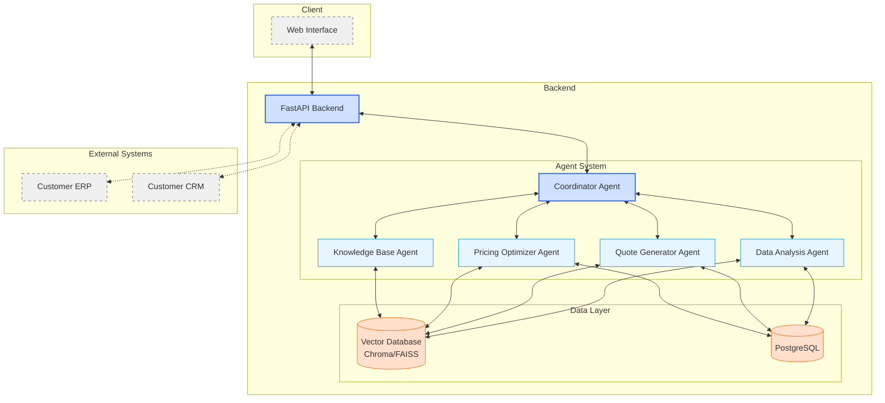

```mermaid
graph TB
    subgraph Client
        UI[Web Interface]
    end
    
    subgraph Backend
        API[FastAPI Backend]
        
        subgraph "Agent System"
            Coordinator[Coordinator Agent]
            DataAnalyst[Data Analysis Agent]
            QuoteGenerator[Quote Generator Agent]
            PricingOptimizer[Pricing Optimizer Agent]
            KnowledgeAgent[Knowledge Base Agent]
        end
        
        subgraph "Data Layer"
            VectorDB[(Vector Database<br>Chroma/FAISS)]
            StructuredDB[(PostgreSQL)]
        end
    end
    
    UI <--> API
    API <--> Coordinator
    
    Coordinator <--> DataAnalyst
    Coordinator <--> QuoteGenerator
    Coordinator <--> PricingOptimizer
    Coordinator <--> KnowledgeAgent
    
    DataAnalyst <--> VectorDB
    DataAnalyst <--> StructuredDB
    QuoteGenerator <--> VectorDB
    QuoteGenerator <--> StructuredDB
    PricingOptimizer <--> VectorDB
    PricingOptimizer <--> StructuredDB
    KnowledgeAgent <--> VectorDB
    
    subgraph "External Systems"
        ERP[Customer ERP]
        CRM[Customer CRM]
    end
    
    API <-.-> ERP
    API <-.-> CRM
    
    classDef primary fill:#d0e0ff,stroke:#3366ff,stroke-width:2px;
    classDef secondary fill:#e6f5ff,stroke:#0099cc,stroke-width:1px;
    classDef storage fill:#ffe0cc,stroke:#ff6600,stroke-width:1px;
    classDef external fill:#f0f0f0,stroke:#666666,stroke-width:1px,stroke-dasharray: 5 5;
    
    class Coordinator,API primary;
    class DataAnalyst,QuoteGenerator,PricingOptimizer,KnowledgeAgent secondary;
    class VectorDB,StructuredDB storage;
    class ERP,CRM,UI external;
```
